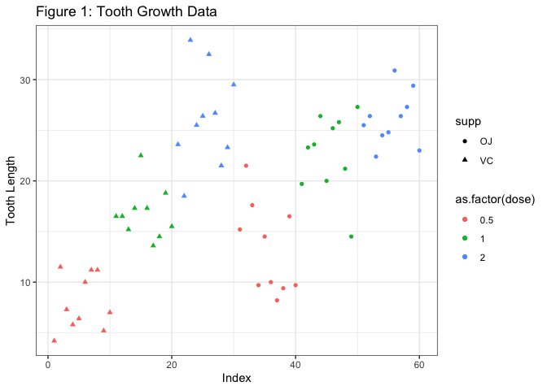

Analysis of Tooth Growth Data
================
Vimal Simha

### Basic Exploratory Data Analysis of Tooth Growth

Our dataset contains 60 observations of the length of odontoblasts (cells responsible for tooth growth) in 10 guinea pigs administered each of three dosage levels of Vitamin C, 0.5, 1 and 2mg, with each of two delivery methods, orange juice (OJ) and Vitamin C (VC). A table summarising the data is provided in the appendix.



Figure 1 shows the tooth length for each of the 60 observations with point shape and colour denoting delivery method and dosage in mg respectively. From inspection, it is clear that toothgrowth increases with increasing dosage for both supplement types, while it is hard to discern a significant difference between the two delivery methods.

### Statistical Analysis of Data

We compare tooth growth of the guinea pigs by dosage and delivery method. Although the same 10 guinea pigs were administered each of the three dosage levels and each of the two delivery methods, the guinea pigs are not identified in the dataset, and so we treat the observations as statistically independent and employ unpaired t-tests.

### Tooth Growth By Delivery Method

Our dataset contains 30 observations of toothgrowth with each of the two delivery methods. We test the null hypothesis that tooth growth is unaffected by delivery method across all dosage levels by carrying out an unpaired two sample t-test.

``` r
t.test(subset(ToothGrowth,supp=="OJ")$len, subset(ToothGrowth,supp=="VC")$len)
```

    ## 
    ##  Welch Two Sample t-test
    ## 
    ## data:  subset(ToothGrowth, supp == "OJ")$len and subset(ToothGrowth, supp == "VC")$len
    ## t = 1.9153, df = 55.309, p-value = 0.06063
    ## alternative hypothesis: true difference in means is not equal to 0
    ## 95 percent confidence interval:
    ##  -0.1710156  7.5710156
    ## sample estimates:
    ## mean of x mean of y 
    ##  20.66333  16.96333

Although orange juice produces higher mean tooth growth than Vitamin C, our 95% confidence interval for the difference in means contains zero, and so we cannot reject the the null hypothesis that tooth growth is unaffected by delivery method. Our p-value indicates that there is a 6% probability of obtaining this result if the null hypothesis were true.

We use the same methodology to compare the two delivery methods for each of the three dosage levels.

For dosage levels of 0.5mg and 1mg, administering orange juice produces significantly higher tooth growth compared to administering Vitamin C. We reject the null hypothesis for these cases because the 95% confidence interval for the difference in means is entirely above zero.

However, for a dosage level of 2mg, there is no difference in tooth growth between the two delivery methods. There is a small difference in means, but we accept the null hypothesis because the 95% confidence interval for the difference in means contains zero, and we obtain a p-value of 0.96 indicating a 96% chance of obtaining our result if the null hypothesis were true.

Confidence intervals, p-values and means and the R-code used to generate these are provided in the Appendix.

### Tooth Growth By Dosage

We now compare tooth growth by dosage level across both delivery methods by carrying out an unpaired two sample t-test with the null hypothesis that tooth growth is unaffected by dosage level.

``` r
t.test(subset(ToothGrowth,dose==2.0)$len, subset(ToothGrowth,dose==1.0)$len)
```

    ## 
    ##  Welch Two Sample t-test
    ## 
    ## data:  subset(ToothGrowth, dose == 2)$len and subset(ToothGrowth, dose == 1)$len
    ## t = 4.9005, df = 37.101, p-value = 1.906e-05
    ## alternative hypothesis: true difference in means is not equal to 0
    ## 95 percent confidence interval:
    ##  3.733519 8.996481
    ## sample estimates:
    ## mean of x mean of y 
    ##    26.100    19.735

``` r
t.test(subset(ToothGrowth,dose==1.0)$len, subset(ToothGrowth,dose==0.5)$len)
```

    ## 
    ##  Welch Two Sample t-test
    ## 
    ## data:  subset(ToothGrowth, dose == 1)$len and subset(ToothGrowth, dose == 0.5)$len
    ## t = 6.4766, df = 37.986, p-value = 1.268e-07
    ## alternative hypothesis: true difference in means is not equal to 0
    ## 95 percent confidence interval:
    ##   6.276219 11.983781
    ## sample estimates:
    ## mean of x mean of y 
    ##    19.735    10.605

Our results indicate that a 2mg dosage produces significantly higher tooth growth than a 1 mg dosage which in turn produces significantly higher tooth growth than a 0.5mg dosage. We reject the null hypothesis in both cases because the 95% confidence interval for the difference in mean tooth growth between the two samples in both cases is entirely above zero, and the p-values i.e. the probability of obtaining our results if the null hypothesis were true are 1.3×10<sup>−7</sup> and 1.9×10<sup>−5</sup> respectively.

When the samples are further divided by delivery method, we find that 2mg dosage produces significantly higher tooth growth than a 1 mg dosage which in turn produces significantly higher tooth growth than a 0.5mg dosage for both delivery methods. We note that increasing the dosage produces a larger increase in toothgrowth when the delivery method is Vitamin C than when the delivery method is Orange Juice. Confidence intervals, p-values and means and the R-code used to generate these are provided in the Appendix.

APPENDIX
--------

### Summary of Tooth Growth Data

``` r
summary(ToothGrowth)
```

    ##       len        supp         dose      
    ##  Min.   : 4.20   OJ:30   Min.   :0.500  
    ##  1st Qu.:13.07   VC:30   1st Qu.:0.500  
    ##  Median :19.25           Median :1.000  
    ##  Mean   :18.81           Mean   :1.167  
    ##  3rd Qu.:25.27           3rd Qu.:2.000  
    ##  Max.   :33.90           Max.   :2.000

### Code for Generating Plot

``` r
library(datasets)
fc = as.factor(ToothGrowth$dose)
ggplot(ToothGrowth, aes(x=c(1:length(len)),y=len, colour=as.factor(dose), shape=supp)) +
  geom_point() +
  xlab("Index") + ylab("Tooth Growth") +
  ggtitle("Figure 1: Tooth Growth Data") +
  theme_bw()
```

### Tooth Growth By Delivery Method

Comparison of tooth growth by delivery method for a given dosage. Confidence intervals, p-values and means and the R-code used to generate them are given below.

``` r
as.vector(t.test(subset(ToothGrowth,supp=="OJ" & dose==0.5)$len, subset(ToothGrowth,supp=="VC" & dose==0.5)$len))
```

    ## 
    ##  Welch Two Sample t-test
    ## 
    ## data:  subset(ToothGrowth, supp == "OJ" & dose == 0.5)$len and subset(ToothGrowth, supp == "VC" & dose == 0.5)$len
    ## t = 3.1697, df = 14.969, p-value = 0.006359
    ## alternative hypothesis: true difference in means is not equal to 0
    ## 95 percent confidence interval:
    ##  1.719057 8.780943
    ## sample estimates:
    ## mean of x mean of y 
    ##     13.23      7.98

``` r
as.vector(t.test(subset(ToothGrowth,supp=="OJ" & dose==1.0)$len, subset(ToothGrowth,supp=="VC" & dose==1.0)$len))
```

    ## 
    ##  Welch Two Sample t-test
    ## 
    ## data:  subset(ToothGrowth, supp == "OJ" & dose == 1)$len and subset(ToothGrowth, supp == "VC" & dose == 1)$len
    ## t = 4.0328, df = 15.358, p-value = 0.001038
    ## alternative hypothesis: true difference in means is not equal to 0
    ## 95 percent confidence interval:
    ##  2.802148 9.057852
    ## sample estimates:
    ## mean of x mean of y 
    ##     22.70     16.77

``` r
as.vector(t.test(subset(ToothGrowth,supp=="OJ" & dose==2.0)$len, subset(ToothGrowth,supp=="VC" & dose==2.0)$len))
```

    ## 
    ##  Welch Two Sample t-test
    ## 
    ## data:  subset(ToothGrowth, supp == "OJ" & dose == 2)$len and subset(ToothGrowth, supp == "VC" & dose == 2)$len
    ## t = -0.046136, df = 14.04, p-value = 0.9639
    ## alternative hypothesis: true difference in means is not equal to 0
    ## 95 percent confidence interval:
    ##  -3.79807  3.63807
    ## sample estimates:
    ## mean of x mean of y 
    ##     26.06     26.14

### Tooth Growth By Dosage

Comparison of tooth growth by dosage for a given delivery method. Confidence intervals, p-values and means and the R-code used to generate them are given below.

``` r
t.test(subset(ToothGrowth,dose==2.0 & supp=="VC")$len, subset(ToothGrowth,dose==1.0 & supp=="VC")$len)
```

    ## 
    ##  Welch Two Sample t-test
    ## 
    ## data:  subset(ToothGrowth, dose == 2 & supp == "VC")$len and subset(ToothGrowth, dose == 1 & supp == "VC")$len
    ## t = 5.4698, df = 13.6, p-value = 9.156e-05
    ## alternative hypothesis: true difference in means is not equal to 0
    ## 95 percent confidence interval:
    ##   5.685733 13.054267
    ## sample estimates:
    ## mean of x mean of y 
    ##     26.14     16.77

``` r
t.test(subset(ToothGrowth,dose==1.0 & supp=="VC")$len, subset(ToothGrowth,dose==0.5 & supp=="VC")$len)
```

    ## 
    ##  Welch Two Sample t-test
    ## 
    ## data:  subset(ToothGrowth, dose == 1 & supp == "VC")$len and subset(ToothGrowth, dose == 0.5 & supp == "VC")$len
    ## t = 7.4634, df = 17.862, p-value = 6.811e-07
    ## alternative hypothesis: true difference in means is not equal to 0
    ## 95 percent confidence interval:
    ##   6.314288 11.265712
    ## sample estimates:
    ## mean of x mean of y 
    ##     16.77      7.98

``` r
t.test(subset(ToothGrowth,dose==2.0 & supp=="OJ")$len, subset(ToothGrowth,dose==1.0 & supp=="OJ")$len)
```

    ## 
    ##  Welch Two Sample t-test
    ## 
    ## data:  subset(ToothGrowth, dose == 2 & supp == "OJ")$len and subset(ToothGrowth, dose == 1 & supp == "OJ")$len
    ## t = 2.2478, df = 15.842, p-value = 0.0392
    ## alternative hypothesis: true difference in means is not equal to 0
    ## 95 percent confidence interval:
    ##  0.1885575 6.5314425
    ## sample estimates:
    ## mean of x mean of y 
    ##     26.06     22.70

``` r
t.test(subset(ToothGrowth,dose==1.0 & supp=="OJ")$len, subset(ToothGrowth,dose==0.5 & supp=="OJ")$len)
```

    ## 
    ##  Welch Two Sample t-test
    ## 
    ## data:  subset(ToothGrowth, dose == 1 & supp == "OJ")$len and subset(ToothGrowth, dose == 0.5 & supp == "OJ")$len
    ## t = 5.0486, df = 17.698, p-value = 8.785e-05
    ## alternative hypothesis: true difference in means is not equal to 0
    ## 95 percent confidence interval:
    ##   5.524366 13.415634
    ## sample estimates:
    ## mean of x mean of y 
    ##     22.70     13.23
